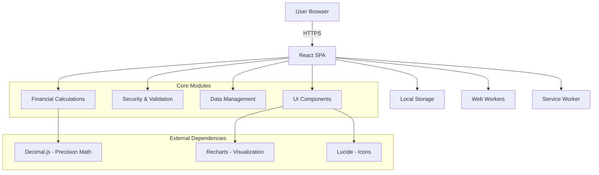

# 🛠️ MangoMoney - Developer Documentation

**Versione:** 3.2.0  
**Data:** 23 Agosto 2025  
**Target:** Sviluppatori e Contributors  

---

## 🚀 Quick Start (5 minuti)

### Prerequisites
- **Node.js:** v18+ (use nvm per gestione versioni)
- **npm:** v9+ (incluso con Node.js)
- **Git:** Versione più recente
- **VS Code:** IDE raccomandato con estensioni

### Setup Rapido
```bash
# 1. Clone repository
git clone https://github.com/Stinocon/MangoMoney.git
cd MangoMoney

# 2. Installa dipendenze
npm install

# 3. Avvia development server
npm start
# Si apre su http://localhost:3000

# 4. Esegui test (opzionale)
npm test

# 5. Build per produzione (opzionale)
npm run build
```

---

## 🏗️ Architettura del Sistema

### System Overview



### Core Components

#### Financial Engine (`src/utils/financialCalculations.ts`)
**Purpose:** Tutti i calcoli finanziari con massima precisione

**Key Functions:**
- `safeCAGR()`: Compound Annual Growth Rate con gestione edge cases
- `calculateSWR()`: Safe Withdrawal Rate usando metodologia Trinity Study
- `calculatePortfolioRiskScore()`: Valutazione rischio semplificata con pesi fissi
- `applyCostBasisMethod()`: Calcoli fiscali FIFO/LIFO/Average Cost

**Design Principles:**
- Usa Decimal.js per precisione finanziaria
- Gestisce edge cases (valori zero, numeri estremi, date invalide)
- Documentato completamente con JSDoc
- Testato estensivamente con dati storici

**Example Usage:**
```javascript
// Calcola CAGR portfolio
const cagr = safeCAGR(
  initialValue: 100000,    // €100,000 iniziale
  finalValue: 150000,      // €150,000 dopo 5 anni  
  years: 5
); // Returns: 8.45%

// Calcola Safe Withdrawal Rate
const swr = calculateSWR(
  totals: portfolioTotals,
  swrRate: 4,              // 4% rate
  inflationRate: 2.5,      // 2.5% inflazione
  monthlyExpenses: 3000    // €3,000/mese spese
); // Returns: analisi SWR dettagliata
```

#### Data Security (`src/utils/security.ts`)
**Purpose:** Sanitizzazione input e prevenzione XSS

**Key Functions:**
- `sanitizeString()`: Rimuove tentativi di injection HTML/JavaScript
- `validateNumber()`: Validazione sicura input numerici
- `sanitizeCSVCell()`: Previene attacchi CSV injection

#### UI Component Library (`src/components/`)
**Architecture:** Metodologia atomic design
- **Atoms:** Button, Input, Icon
- **Molecules:** Form fields, Card, Tooltip
- **Organisms:** Portfolio table, Chart components
- **Pages:** Dashboard, Settings, Asset management

#### State Management
**Pattern:** React hooks con Context API
**Structure:**
```
src/context/
├── PortfolioContext.js     # Portfolio data state
├── SettingsContext.js      # User preferences  
├── UIContext.js           # UI state (modals, notifications)
└── ThemeContext.js        # Dark/light theme
```

---

## 📁 Project Structure

```
MangoMoney/
├── public/                          # Static assets
│   ├── index.html                   # HTML template
│   └── favicon.ico                  # App icon
├── src/
│   ├── components/                  # Reusable UI components
│   │   ├── AccessibleComponents.tsx # WCAG compliant components
│   │   ├── AccessibleCharts.tsx     # Chart components
│   │   └── VirtualizedTable.tsx     # Performance table
│   ├── hooks/                       # Custom React hooks
│   │   ├── useAutoBackup.ts         # Automatic backup
│   │   ├── useFormValidation.ts     # Form validation
│   │   └── useKeyboardNavigation.ts # Accessibility
│   ├── utils/                       # Utility functions
│   │   ├── financialCalculations.ts # Core financial math
│   │   ├── security.ts              # Input sanitization
│   │   ├── advancedSecurity.ts      # Advanced security
│   │   ├── secureStorage.ts         # Encrypted storage
│   │   ├── privacyCompliance.ts     # GDPR compliance
│   │   └── validations.ts           # Data validation
│   ├── translations/                # Internationalization
│   │   ├── it.ts                    # Italian translations
│   │   └── en.ts                    # English translations
│   ├── styles/                      # CSS and styling
│   │   └── designSystem.css         # Design tokens
│   ├── App.tsx                      # Main application component
│   └── index.tsx                    # Application entry point
├── docs/                            # Documentation
│   ├── user-manual/                 # User documentation
│   ├── developers/                  # Developer documentation
│   └── legal/                       # Legal documentation
├── tests/                           # Test files
│   ├── __mocks__/                   # Test mocks
│   ├── integration/                 # Integration tests
│   └── setup.ts                     # Test setup
└── package.json                     # Dependencies & scripts
```

---

## 🛠️ Development Scripts

```json
{
  "start": "react-scripts start",                    // Dev server con hot reload
  "build": "react-scripts build",                    // Production build
  "test": "react-scripts test",                      // Interactive test runner
  "test:coverage": "npm test -- --coverage",         // Test con coverage report
  "test:ci": "npm test -- --ci --coverage",          // CI test mode
  "lint": "eslint src/ --ext .js,.jsx,.ts,.tsx",     // Code linting
  "lint:fix": "eslint src/ --fix",                   // Auto-fix linting issues
  "type-check": "tsc --noEmit",                      // TypeScript check
  "analyze": "npm run build && npx webpack-bundle-analyzer build/static/js/*.js"
}
```

---

## 📋 Coding Standards

### TypeScript Configuration
```typescript
// ✅ Strict TypeScript settings
{
  "compilerOptions": {
    "strict": true,                    // Enable all strict checks
    "noImplicitReturns": true,         // Function must return explicitly
    "noFallthroughCasesInSwitch": true, // Switch cases must break
    "noUncheckedIndexedAccess": true   // Array access safety
  }
}
```

### Code Style
- **Prettier:** Auto-formatting on save
- **ESLint:** Enforce coding standards
- **Naming:** camelCase per funzioni, PascalCase per componenti
- **Comments:** JSDoc per tutte le funzioni esportate

### Financial Code Standards
```typescript
// ✅ GOOD: Explicit precision handling
const result = safeAdd(amount1, amount2);
const percentage = safePercentage(gain, total);

// ❌ BAD: Native JavaScript math per calcoli finanziari  
const result = amount1 + amount2;           // Floating point errors
const percentage = (gain / total) * 100;    // Precision loss
```

### Testing Standards
- **Unit Tests:** Tutte le funzioni finanziarie devono avere 90%+ coverage
- **Test Data:** Usa scenari finanziari realistici
- **Edge Cases:** Testa valori zero, numeri negativi, input estremi
- **Historical Data:** Valida contro dati finanziari noti

---

## 🔒 Security Guidelines

### Input Validation
```typescript
// ✅ Secure input handling
const sanitizedAmount = sanitizeAmount(userInput);
const validatedNumber = validateNumber(sanitizedAmount, 0, 1000000);

// ✅ XSS prevention
const safeDescription = sanitizeString(userDescription, 500);

// ✅ CSV injection prevention
const safeCSVValue = sanitizeCSVCell(userValue);
```

### Data Encryption
```typescript
// ✅ Encrypted storage
secureLocalStorage.setItem('portfolio-data', sensitiveData);

// ✅ Secure retrieval
const data = secureLocalStorage.getItem('portfolio-data', defaultValue);
```

### Content Security Policy
```html
<!-- ✅ CSP headers in public/index.html -->
<meta http-equiv="Content-Security-Policy" content="
  default-src 'self';
  script-src 'self' 'unsafe-inline';
  style-src 'self' 'unsafe-inline';
  img-src 'self' data: blob:;
  font-src 'self' data:;
  connect-src 'self' ws: wss: localhost:*;
  frame-ancestors 'none';
  base-uri 'self';
  form-action 'self';
  object-src 'none';
">
```

---

## 🧪 Testing Strategy

### Unit Tests
```typescript
// ✅ Financial function testing
describe('safeCAGR', () => {
  test('should calculate CAGR correctly', () => {
    const result = safeCAGR(10000, 15000, 5);
    expect(result).toBeCloseTo(8.45, 2);
  });

  test('should handle edge cases', () => {
    expect(safeCAGR(0, 1000, 1)).toBe(0);
    expect(safeCAGR(1000, 0, 1)).toBe(-100);
  });
});
```

### Integration Tests
```typescript
// ✅ User workflow testing
describe('Portfolio Management', () => {
  test('should add asset and update calculations', async () => {
    // Test complete user workflow
    await user.click(screen.getByText('Aggiungi Asset'));
    await user.type(screen.getByLabelText('Nome'), 'VWCE ETF');
    await user.type(screen.getByLabelText('Valore'), '10000');
    await user.click(screen.getByText('Salva'));
    
    expect(screen.getByText('€10,000')).toBeInTheDocument();
  });
});
```

### Performance Tests
```typescript
// ✅ Performance benchmarking
describe('Performance', () => {
  test('should calculate portfolio under 100ms', () => {
    const start = performance.now();
    calculatePortfolioMetrics(largeDataset);
    const duration = performance.now() - start;
    
    expect(duration).toBeLessThan(100);
  });
});
```

---

## 🚀 Performance Optimization

### React Optimization
```typescript
// ✅ Memoization per calcoli costosi
const portfolioMetrics = useMemo(() => {
  return calculatePortfolioMetrics(assets);
}, [assets]);

// ✅ Callback optimization
const handleAssetUpdate = useCallback((assetId, newValue) => {
  updateAsset(assetId, newValue);
}, [updateAsset]);
```

### Bundle Optimization
```typescript
// ✅ Code splitting
const AdvancedCharts = lazy(() => import('./components/AdvancedCharts'));

// ✅ Tree shaking
import { Button } from './components/AccessibleComponents';
// Non importa tutto il bundle
```

### Memory Management
```typescript
// ✅ Cleanup effects
useEffect(() => {
  const interval = setInterval(updateMetrics, 5000);
  return () => clearInterval(interval);
}, []);

// ✅ Debounced operations
const debouncedSave = useMemo(
  () => debounce(saveToStorage, 1000),
  [saveToStorage]
);
```

---

## 🔄 Git Workflow

### Feature Development
```bash
# Feature development workflow
git checkout main
git pull origin main
git checkout -b feature/portfolio-performance-enhancement

# Development...
git add .
git commit -m "feat: add advanced CAGR calculation with period validation"

# Before pushing
npm run lint:fix
npm run type-check  
npm test

git push origin feature/portfolio-performance-enhancement
# Create pull request on GitHub
```

### Commit Message Convention
```bash
# ✅ Conventional Commits
feat: add new financial calculation
fix: resolve CAGR calculation edge case
docs: update user manual with new features
test: add unit tests for SWR calculation
refactor: improve portfolio calculation performance
style: format code according to style guide
chore: update dependencies
```

---

## 🐛 Debugging

### Browser DevTools
- **React DevTools:** Inspect component state
- **Performance Tab:** Profile calculation performance
- **Application Tab:** Inspect localStorage data
- **Console:** Financial calculation debugging

### Common Issues
```javascript
// ✅ Debug financial calculations
if (process.env.NODE_ENV === 'development') {
  console.log('Portfolio Calculation Debug:', {
    totalAssets: formatCurrency(total),
    calculations: calculationSteps,
    warnings: validationWarnings
  });
}

// ✅ Debug performance
import { performanceMarker } from './utils/monitoring';
performanceMarker.start('portfolio-calculation');
const result = calculatePortfolioMetrics(assets);
performanceMarker.end('portfolio-calculation');
```

---

## 📦 Building for Production

### Environment Variables
```bash
# ✅ .env.production
REACT_APP_ENVIRONMENT=production
REACT_APP_VERSION=%npm_package_version%
REACT_APP_SENTRY_DSN=your_sentry_dsn
REACT_APP_GA_TRACKING_ID=your_ga_id
```

### Build Optimization
```bash
# Production build con analysis
npm run build
npm run analyze  # Bundle size analysis

# Deploy to staging
npm run deploy:staging

# Deploy to production  
npm run deploy:production
```

---

## 🤝 Contributing

### How to Contribute
1. **Fork** il repository
2. **Create** un branch per la feature
3. **Develop** seguendo le coding standards
4. **Test** con coverage >90%
5. **Document** le modifiche
6. **Submit** pull request

### Code Review Process
- **Automated checks:** ESLint, TypeScript, Tests
- **Manual review:** Architecture, security, performance
- **Documentation:** Update docs if needed
- **Testing:** Verify in different browsers

### Contribution Guidelines
- **Follow** existing code style
- **Add tests** for new features
- **Update documentation** for API changes
- **Consider** accessibility for UI changes
- **Test** on mobile devices

---

### Resources
- **React Documentation:** https://react.dev/
- **TypeScript Handbook:** https://www.typescriptlang.org/docs/
- **Financial Math:** https://en.wikipedia.org/wiki/Compound_annual_growth_rate
- **WCAG Guidelines:** https://www.w3.org/WAI/WCAG21/quickref/

---

*Ultimo aggiornamento: 28 Agosto 2025 - Versione 4.0.0*
